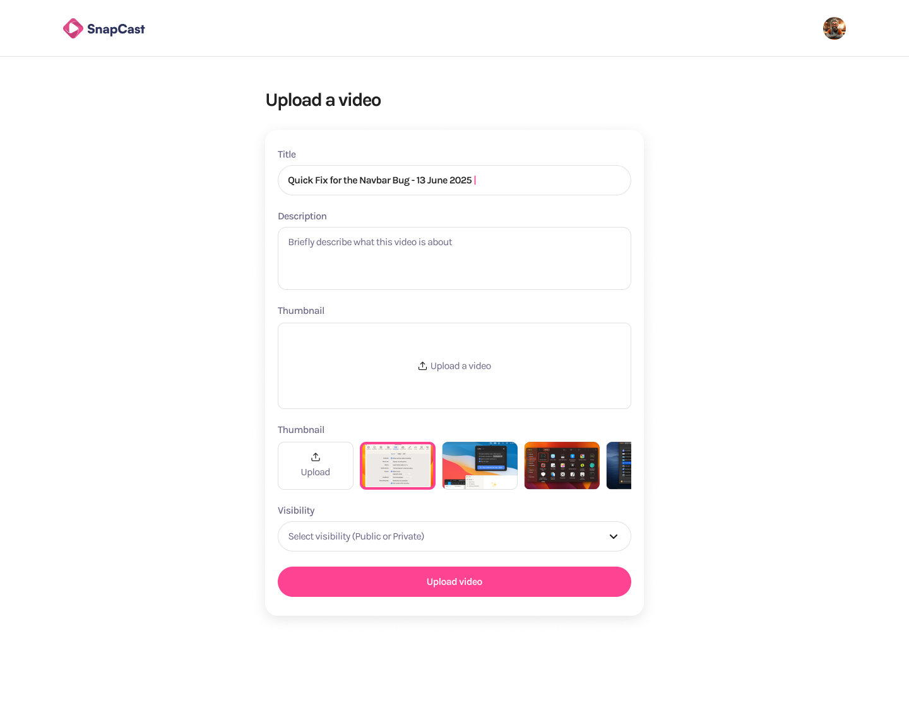

# 🎥 Plataforma de Compartición y Grabación de Videos

    

## 📋 Descripción

Una plataforma moderna y potente para compartir, grabar y gestionar contenido de video, construida con las últimas tecnologías web de 2025. Esta aplicación permite a los usuarios grabar videos directamente desde su navegador, compartirlos con otros y gestionar su biblioteca de contenido multimedia.

<div align="center">
  
  <p><em>Nota: Imagen de vista previa pendiente</em></p>
</div>

## ✨ Características Principales

- **Grabación de Video en Tiempo Real** - Captura video directamente desde tu navegador sin necesidad de software adicional
- **Compartición Instantánea** - Comparte tus videos con un simple enlace
- **Interfaz Moderna** - Diseño intuitivo y responsive utilizando TailwindCSS 4
- **Autenticación Segura** - Sistema de autenticación robusto
- **Optimización de Rendimiento** - Carga rápida y experiencia fluida gracias a Next.js 15 y React 19
- **Compatibilidad Total** - Funciona en todos los dispositivos y navegadores modernos

## 🚀 Tecnologías

- **Frontend**: React 19, Next.js 15.3.2
- **Estilos**: TailwindCSS 4.1.6
- **Lenguaje**: TypeScript 5.8.3
- **Desarrollo**: Turbopack para compilación ultrarrápida
- **Fuentes**: Satoshi (variable font)

## 🛠️ Requisitos Previos

- Node.js 20.x o superior
- npm, yarn, pnpm o bun

## ⚙️ Instalación

1. **Clona el repositorio**

```bash
git clone https://github.com/tu-usuario/video-sharing-and-recording-platform.git
cd video-sharing-and-recording-platform
```

2. **Instala las dependencias**

```bash
pnpm install  # o npm install, yarn, bun install
```

3. **Configura las variables de entorno**

Crea un archivo `.env.local` en la raíz del proyecto con las siguientes variables:

```env
NEXT_PUBLIC_API_URL=tu_url_api
# Añade otras variables según sea necesario
```

## 🚀 Uso

### Desarrollo

Inicia el servidor de desarrollo con Turbopack para una experiencia de desarrollo ultrarrápida:

```bash
pnpm dev  # o npm run dev, yarn dev, bun dev
```

Abre [http://localhost:3000](http://localhost:3000) en tu navegador para ver la aplicación.

### Producción

Compila la aplicación para producción:

```bash
pnpm build  # o npm run build, yarn build, bun build
```

Inicia el servidor de producción:

```bash
pnpm start  # o npm start, yarn start, bun start
```

## 📁 Estructura del Proyecto

```
├── app/                # Directorio principal de la aplicación (Next.js App Router)
│   ├── (auth)/         # Rutas relacionadas con autenticación
│   ├── (root)/         # Rutas principales de la aplicación
│   ├── layout.tsx      # Diseño principal de la aplicación
│   └── page.tsx        # Página principal
├── constants/          # Constantes y configuraciones
├── fonts/              # Fuentes personalizadas (Satoshi)
├── public/             # Archivos estáticos
│   └── assets/         # Imágenes y otros recursos
└── ...                 # Otros archivos de configuración
```

## 🧪 Testing

Ejecuta las pruebas con el siguiente comando:

```bash
pnpm test  # o npm test, yarn test, bun test
```

## 📱 Responsive Design

La plataforma está diseñada para funcionar perfectamente en dispositivos de todos los tamaños:

- 📱 Móviles (a partir de 320px)
- 📱 Tablets (a partir de 768px)
- 💻 Portátiles (a partir de 1024px)
- 🖥️ Escritorios (a partir de 1280px)
- 🖥️ Pantallas grandes (a partir de 1536px)

## 🌐 Despliegue

La forma más sencilla de desplegar esta aplicación es utilizando la [Plataforma Vercel](https://vercel.com/new?utm_medium=default-template&filter=next.js&utm_source=create-next-app&utm_campaign=create-next-app-readme), creada por los desarrolladores de Next.js.

Consulta la [documentación de despliegue de Next.js](https://nextjs.org/docs/app/building-your-application/deploying) para más detalles.

## 🤝 Contribución

Las contribuciones son bienvenidas. Por favor, sigue estos pasos:

1. Haz fork del repositorio
2. Crea una rama para tu característica (`git checkout -b feature/amazing-feature`)
3. Haz commit de tus cambios (`git commit -m 'Add some amazing feature'`)
4. Haz push a la rama (`git push origin feature/amazing-feature`)
5. Abre un Pull Request

## 📄 Licencia

Este proyecto está licenciado bajo la Licencia MIT - ver el archivo [LICENSE](LICENSE) para más detalles.

---

<p align="center">Desarrollado con ❤️ utilizando Next.js 15 y React 19</p>
